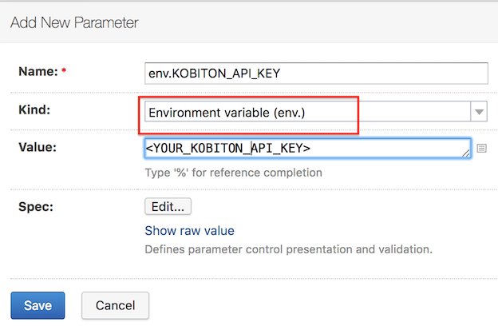

# Running Automation test with Kobiton
This guide will demonstrate how to run an automation test with Kobiton on Teamcity.
## Table of contents
[1. Setup TeamCity](#1-setup-teamcity)

[2. Prepare Kobiton configuration for executing automation testing](#2-prepare-kobiton-configuration-for-executing-automation-testing)

[3. Write the automation test script](#3-write-the-automation-test-script)

[4. Configure your TeamCity project for Kobiton testing](#4-configure-your-teamcity-project-for-kobiton-testing)

[5. Call Kobiton REST API to get session information](#5-call-kobiton-rest-api-to-get-session-information)
## Prerequisites 
- Java(JRE). Supported are:
  + Oracle java 8 or higher
  + OpenJDK 8
- Kobiton account
## 1. Setup TeamCity
This part will guide you how to setup TeamCity and configure TeamCity with GitHub. Skip step if you already have TeamCity setup.
 + You can download TeamCity from [here](https://www.jetbrains.com/teamcity/download/).  
 + For the introduction on how to install and configure the TeamCity server, follow [this guide](https://confluence.jetbrains.com/display/TCD18/Installing+and+Configuring+the+TeamCity+Server).

Set up your project and link your app repository that we will test with Kobiton later.
+ Connect GitHub with TeamCity, you can follow [this guide](https://confluence.jetbrains.com/display/TCD10/Integrating+TeamCity+with+VCS+Hosting+Services).
 
+ More information about TeamCity can be found in [this tutorial](https://confluence.jetbrains.com/display/TCD10/TeamCity+Documentation).

## 2. Prepare Kobiton configuration for executing automation testing 
You can visit [here](https://kobiton.com/blog/automation-web-appium-kobiton-nodejs/) and navigate to `Configure test scripts for Kobiton` to get Kobiton username, Kobiton API.
## 3. Write the automation test script
**a. Desired capabilities**

 Kobiton provides the so-called Automation Settings for each device on which you want to run tests. Actually Automation Settings are the desired capabilities that need to be added to the Appium test script in order for tests to be executed on the Kobiton devices.
+ In the navigation bar at the top of the Kobiton website, select `Devices`.
 
 
 
 + Hover over any device and click on the Automation settings button. A dialog box will then appear on screen.
 
 
 
 + On the left hand side, you can select your preferred language, App Type...
 
  
 **b. Run automation test**
+ Kobiton already provide some example for basic automation test. For samples of automation tests, go to https://github.com/kobiton/samples .
+ Choose a language for your test script, and decide whether you want to test on Android or IOS , and either do a web test or an app test. 
+ Make sure in the code you specify your Kobiton username, API key and replace the `desiredCaps`.

Example:

```javascript
const username = process.env.KOBITON_USERNAME
const apiKey = process.env.KOBITON_API_KEY
 const kobitonServerConfig = {
  protocol: 'https',
  host: 'api-test.kobiton.com',
  auth: `${username}:${apiKey}`
}
 var desiredCaps = {
  sessionName:        'Automation test session',
  sessionDescription: '', 
  deviceOrientation:  'portrait',  
  noReset:            true,
  fullReset:          false, 
  captureScreenshots: true,
  app:                {your_app_id}, 
  udid:               {your_device_udid}
}
```

## 4. Configure your TeamCity project for Kobiton testing
You can attach an enviroment variable to TeamCity(Optional).
+ In your project in TeamCity, on the left side of the page, click on 'Parameters'. Then click the `Add new parameter` button. 


+ Add your Kobiton username and API key.




Now, we will add a build step to run automation test.
+ In your project in TeamCity, on the left side on the page, click on 'Build Step' to set build steps.
+ On the right side of the page,  for the 'Runner type' category, choose 'Command Line '.
+ Add command lines to your script content.

Example: 
```
  cd javascript
  npm install
  npm run android-web-test
```
> Note:
> + `npm install` is the command if you using NodeJS 
> + `npm run android-web-test` is the command to run the test script


+ Now, try to build on Teamity and check Kobiton cloud devices to see if a test session was created.

## 5. Call Kobiton REST API to get session information

Kobiton already provides a Node.js sample on how to get session information, get session commands using Kobiton REST API. Go to https://github.com/kobiton/samples, select the folder named 'REST API' and follow the instruction.

> For more details on how to retrieve information about your session, go to https://api.kobiton.com/docs/