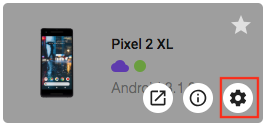

# Integrating Kobiton into TeamCity mobile application development pipeline
## Table of contents
- [A. Integrating Kobiton with TeamCity](#a-integrating-kobiton-with-TeamCity)
    - [1. Preparation](#1-preparation)
        - [1.1. Getting Kobiton Username and API key](#11-getting-kobiton-username-and-api-key)
        - [1.2. Samples](#12-samples)
        - [1.3. Execution environment](#13-execution-environment)
    - [2. Setup](#2-setup)
        - [2.1. Getting started](#21-getting-started)
        - [2.2. Setting Kobiton Username and API Key](#22-setting-kobiton-username-and-api-key)
        - [2.3. Setting Kobiton device desired capabilities](#23-setting-kobiton-device-desired-capabilities)
        - [2.4. Configuring TeamCity project](#24-configuring-teamcity-project)
    - [3. Automation test execution](#3-automation-test-execution)
- [B. Test session details](#b-test-session-details)
    - [1. Viewing test session details on Kobiton website](#1-viewing-test-session-details-on-kobiton-website)
    - [2. Fetching test session details using Kobiton REST API](#2-fetching-test-session-details-using-kobiton-rest-api)
- [C. Feedback](#c-feedback)

## A. Integrating Kobiton with TeamCity
### 1. Preparation
#### 1.1. Getting Kobiton Username and API key
Kobiton Username and API key are required for authenticating with Kobiton API.

> If you don't have a Kobiton account, visit https://portal.kobiton.com/register to create one.

To get your Kobiton Username and API Key, follow instructions at `IV. Configure Test Script for Kobiton` section on [our blog](https://kobiton.com/blog/tutorial/parallel-testing-selenium-webdriver/).

#### 1.2. Samples
To give you an in-depth demonstration of the integration flow, we have provided samples:
- Script (written in NodeJS) for executing automation test on Kobiton devices : [automation-test-script.js](/samples/automation-test/automation-test-script.js).

You can check out the sample content or keep reading because they are used in below steps as well.

#### 1.3. Execution environment
On machine running TeamCity build agent:
- If you want to execute on host: Install latest version of NodeJS.
> Refer to https://nodejs.org/en/download/ for instructions on how to install NodeJS.
- If you want to execute on Docker: Install latest version of Docker.
> Refer to https://www.docker.com/products/docker-desktop for instructions on how to install Docker.

> Note: The machine running TeamCity build agent can be the one running TeamCity Server or other.

### 2. Setup
#### 2.1 Getting started
Follow steps below to get started:

1. Fork this repository.
2. Create a TeamCity project pointing to the forked repository.
> Refer to [TeamCity Documentation](https://confluence.jetbrains.com/display/TCD18/Creating+and+Editing+Projects) for instructions on how to create a TeamCity project pointing to a repository.

#### 2.2. Setting Kobiton Username and API key
In your project configuration in TeamCity, add two environment variables :
- `KOBITON_USERNAME` : Your Kobiton's username.
- `KOBITON_API_KEY` : Your Kobiton's API Key.

Your `Environment Variables` window should look like this


#### 2.3. Setting Kobiton device desired capabilities
In order to execute tests on a specific device in Kobiton, its corresponding desired capabilities needs to be supplied.

The provided automation testing script has been pre-configured to execute automation test of a demo Android application on a random, available Android devices.

**Demo application details**
```
- Filename: ApiDemos-debug.apk
- Download link: https://appium.github.io/appium/assets/ApiDemos-debug.apk
```

If you want to execute on a specific device, refer to instructions below to get the corresponding desired capabilities for that device.

1. Go to https://portal.kobiton.com/login and login with your Kobiton account.
2. Click **"Devices"** at the top of the window.


3. Hover over the device you want to execute on (in this example: `Pixel 2 XL`), click the gear button.



4. In the `Automation Settings` popup:
- In `Language` section, choose `NodeJS`.
- In `App Type` section, choose `Hybrid/Native from Url`.
- In `Application Url` section, put `https://appium.github.io/appium/assets/ApiDemos-debug.apk`.


5. From the collected desired capabilities, add these environment variables with corresponding values to your project configuration in TeamCity as shown in the table below

| TeamCity Environment Variable       | Desired Capabilities Variable  | Description                                         | Default Value                                             |
|-------------------------------------|--------------------------------|-----------------------------------------------------|-----------------------------------------------------------|
| KOBITON_DEVICE_PLATFORM_NAME        | platformName                   | Kobiton Device Platform Name (e.g: Android, iOS)    | Android                                                   |
| KOBITON_DEVICE_NAME                 | deviceName                     | Kobiton Device Name                                 | Galaxy*                                                   |
| KOBITON_DEVICE_PLATFORM_VERSION     | platformVersion                | Kobiton Device Platform Version                     | *No*                                                      |
| KOBITON_SESSION_DEVICE_ORIENTATION  | deviceOrientation              | Device Orientation (e.g: Portrait, Landscape)       | portrait                                                  |
| KOBITON_SESSION_CAPTURE_SCREENSHOTS | captureScreenshots             | Enable screenshots capture during session execution | true                                                      |
| KOBITON_SESSION_DEVICE_GROUP        | deviceGroup                    | Kobiton device group                                | KOBITON                                                   |
| KOBITON_ORGANIZATION_GROUP_ID       | groupId                        | Group ID of the device                              | *No*                                                      |
| KOBITON_SESSION_APPLICATION_URL     | app                            | Download link to the application used for testing   | https://appium.github.io/appium/assets/ApiDemos-debug.apk |

For example, if desired capabilities for executing automation test of the provided demo Android application on Pixel 2 XL running Android 8.1.0:

```javascript
var desiredCaps = { 
  sessionName:        'Sample Automation Test Session',
  sessionDescription: 'This is a sample automation test session', 
  deviceOrientation:  'portrait',  
  captureScreenshots: false, 
  app:                'https://appium.github.io/appium/assets/ApiDemos-debug.apk',
  deviceGroup:        'KOBITON', 
  groupId:            100,
  deviceName:         'Pixel 2 XL',
  platformVersion:    '8.1.0',
  platformName:       'Android' 
}
```

The environment variables representing above desired capabilities should look like this:


> More information about Desired Capabilities and its parameters can be found in https://docs.kobiton.com/automation-testing/desired-capabilities-usage/

#### 2.4. Configuring TeamCity project
In your project settings, follow steps below to configure your TeamCity project:
1. Add a `Build Configuration`.


2. In your newly added `Build Configuration`, add a new `Build Step` with the following details:
- Runner type: `Command Line`
- Working directory: `samples/automation-test`
- Run: `Custom script`
- Custom script:
```bash
npm install
npm run automation-test-script
```


Here is the in-depth explanation of the above script in `Custom script` section:
- Install missing dependencies
```bash
npm install
```

- Execute automation test script on Kobiton
```bash
npm run automation-test-script
```

**Note** : If you want to execute the provided script in Docker, please add some configurations in `Docker Settings` in your build step:
- Run step within Docker container: `node:latest`
- Docker image platform: `Any`


> For more information about how to execute automation test(s) on Kobiton, you can visit:
> - [Kobiton automation testing documentation](https://docs.kobiton.com/automation-testing/automation-testing-with-kobiton/)
> - [Kobiton sample automation test scripts in other languages](https://github.com/kobiton/samples)

### 3. Automation test execution
- Simply initiate the build process on TeamCity and it will execute the automation test script on Kobiton.
- Your test execution progress can be viewed on TeamCity.


- Your test execution progress can also be viewed on Kobiton


## B. Test session details
### 1. Viewing test session details on Kobiton website

Your test session can be viewed on Kobiton website. Follow these steps below

1. Go to https://portal.kobiton.com/sessions, login with your Kobiton account.
2. You will see your executed sessions and their statuses.


3. Click on any session to view its details, commands.

### 2. Fetching test session details using Kobiton REST API

Kobiton has already provided samples written in NodeJS to get session information, commands using Kobiton REST API.

Refer to [Kobiton sample for REST API](https://github.com/kobiton/samples/tree/master/kobiton-rest-api) for instructions.

## C. Feedback

If you have any issue or further information, follow steps below to request Kobiton for support.

1. Go to https://portal.kobiton.com
2. In the navigation bar at the top of the page, click `Support`.


3. Fill in all necessary information and click `Submit`.

