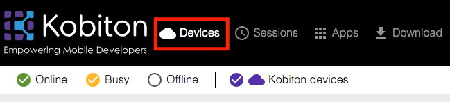
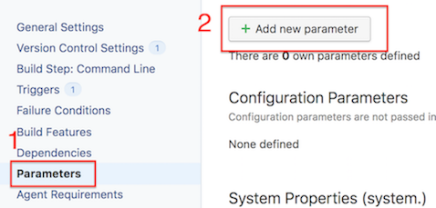
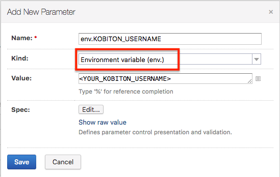
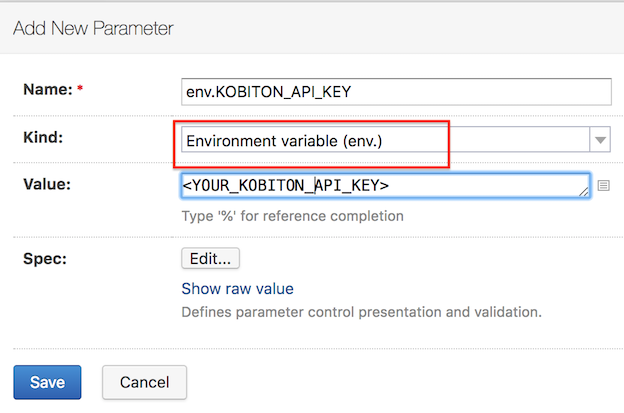
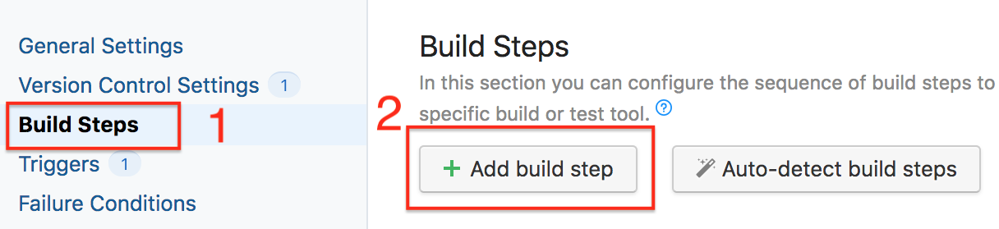

# Running Automation test with Kobiton
## Table of contents
+ [Prerequisites](#prerequisites)
+ [1. Configure TeamCity and integrate with GitHub](#1-configure-teamcity-and-integrate-with-github)
+ [2. Configure automation test script](#2-configure-automation-test-script)
+ [3. Run automation test on Kobiton devices](#3-run-automation-test-on-kobiton-devices)
+ [4. Fetch test session data through Kobiton REST API](#4-fetch-test-session-data-through-kobiton-rest-api)
+ [5. Feedback](#5-feedback)
## Prerequisites 
- Java(JRE) for running TeamCity server. Supported versions:
  + Oracle Java 8 and updates. 32 or 64 bit (64 bit is recommended for production)
  + OpenJDK 8. 32 or 64 bit
  
  Go to [this link](http://www.oracle.com/technetwork/java/javase/downloads/jre8-downloads-2133155.html) to download Java.
- Kobiton account: Go to https://portal.kobiton.com/register to create new account. They're necessary for automation test with Kobiton.
## 1. Configure TeamCity and integrate with GitHub
Firstly, let's assume you already have an empty GitHub repository for running automation test.

This part will guide you to how to configure TeamCity to integrate with your automation test GitHub repository. Skip this step if you have already had TeamCity setup.
 + For instruction on how to install and configure TeamCity server, follow [this guide](https://confluence.jetbrains.com/display/TCD18/Installing+and+Configuring+the+TeamCity+Server).
+ You need to configure a connection to your GitHub repository. Instruction on how to connect GitHub with TeamCity can be found [this guide](https://confluence.jetbrains.com/display/TCD10/Integrating+TeamCity+with+VCS+Hosting+Services), in `Connecting to GitHub` section. The connection is configured, and now TeamCity will be granted full control of private repositories and the Write repository hooks permission.
 
For more information about TeamCity can be found in [this tutorial](https://confluence.jetbrains.com/display/TCD10/TeamCity+Documentation).

## 2. Configure automation test script
### 2.1 Get Username and API key
Go to https://portal.kobiton.com and login to your Kobiton account.
- Username
  + Click *user icon* -> **"Profile"** (you might find it in the top right corner)

  

- API key 
  + Click *user icon* -> **"Settings"**

  

### 2.2 Get desired capabilities
The desired capabilities need to be added to the automation test script to allow the test to be executed on Kobiton device.
  + Click **Devices** in the top navigation bar.
 
    
 
  + Hover over any device you want to test with and click on the Automation settings button (the gear symbol).
 
    
 
  + On the left-hand side, you can select your preferred language, App Type, etc.
  In this example, we use **NodeJS** as the default language of the script. Therefore, choose **NodeJS** in `Language` section and **Hybrid/Native from Apps** in `App type` section. On the right-hand side, Kobiton automatically generates your desired capabilities into code based on the options you selected. Copy the code to prepare for the next step.

     
### 2.3 Configure automation test script
Kobiton has already provided sample scripts for automation testing, visit [here](https://github.com/kobiton/samples) for reference. 
> Note: In this guideline, we will use the Node.js sample (samples/javascript folder) as an example.

Open automation test script file in your repository or create a new one.

Replace `desiredCaps` in the script with ones collected in the previous step.

Example:

```javascript
var desiredCaps = {
  sessionName:        'Automation test session',
  sessionDescription: '', 
  deviceOrientation:  'portrait',  
  captureScreenshots: true, 
  app:                '<APP_URL>', 
  deviceGroup:        'KOBITON', 
  deviceName:         '<DEVICE_NAME>',
  platformVersion:    '<DEVICE_VERSION>',
  platformName:       '<DEVICE_PLATFORM_NAME>' 
}
```
### 2.4 Configure TeamCity project
**Attaching environment variable to Teamcity**
+ In your project in TeamCity, on the left side of the page, click **Parameters**. Then click **Add new parameter** button. 



+ Add your Kobiton username and API key.





**Setup TeamCity automation testing**

Follow steps below to setup TeamCity for automation testing.

1. In your TeamCity project, on the left side of the page, click **Build Steps** -> **Add build step** to set build steps.



2. On the right side of the page, for the **Runner type** category, choose **Command Line**.
3. Add your commands in **Custom script** section for run automation test.

   Because we use `android-app-test` written in NodeJS as our automation test script. Therefore, the execution command should be like:


## 3. Run automation test on Kobiton devices
+ Push your changes to GitHub. TeamCity will install necessary dependencies and then run the test on Kobiton.


+ Go to https://portal.kobiton.con/sessions to check your testing session status.


## 4. Fetch test session data through Kobiton REST API

+ Kobiton already provides Node.js samples on how to get session information, session commands using Kobiton REST API. 
+ Go to https://github.com/kobiton/samples/rest-api and follow the instructions.
## 5. Feedback
If you have any issue, you can contact Kobiton for more support.
- Go to https://portal.kobiton.com
- In the navigation bar at the top of the page, click on **Support**.


 - Fill in the information for your request and submit your ticket. 
  
