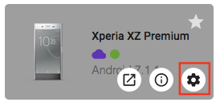
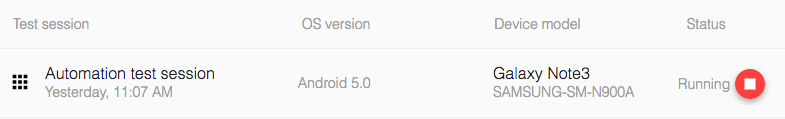

# Running Automation test with Kobiton
## Table of contents
+ [A. Prerequisites](#a-prerequisties)
+ [B. Setup](#b-setup)
  + [1. Prepare automation test responsibility](#1-prepare-automation-test-responsibility)
  + [2. Get desired capabilities](#2-get-desired-capabilities)
  + [3. Configure automation test script](#3-configure-automation-test-script)
  + [4. Configure TeamCity project](#4-configure-teamcity-project)
+ [C. Outcome](#c-outcome)
  + [1. Run automation test on Kobiton devices](#1-run-automation-test-on-kobiton-devices)
  + [2. Fetch test session data through Kobiton REST API](#2-fetch-test-session-data-through-kobiton-rest-api)
  + [3. Feedback](#3-feedback)
## A. PREREQUISTIES 
- Kobiton account: Go to https://portal.kobiton.com/register to create new account. They're necessary for automation test with Kobiton.
- Kobiton Username and API Key: Folow instruction at `IV. Configure Test Script for Kobiton` section on [our blog article](https://kobiton.com/blog/tutorial/parallel-testing-selenium-webdriver/) to get Username and API Key. 
## B. SETUP
### 1. Prepare automation test responsibility
To test app on Kobiton using automation testing, you need a GitHub repository that is fully configured with TeamCity. You can use our repository if you don't have one.

In this guideline, we will use the Node.js [sample](https://github.com/phanthaoIT/TeamCity-TestFlight-Appium-ReactNative/tree/KOB-3112-KOB-3248/sample) as an example. If you use other languages, you can visit [here](https://github.com/kobiton/samples) for reference. 

### 2. Get desired capabilities
The desired capabilities need to be added to the automation test script to allow the test to be executed on Kobiton device.
  + Click **Devices** in the top navigation bar.
 
    
 
  + Hover over any device you want to test with and click on the Automation settings button (the gear symbol).
 
    
 
  + On the left-hand side, you can select your preferred language, App Type, etc.
  In this example, we use **NodeJS** as the default language of the script. Therefore, choose **NodeJS** in `Language` section and **Hybrid/Native from Apps** in `App type` section. On the right-hand side, Kobiton automatically generates your desired capabilities into code based on the options you selected. Copy the code to prepare for the next step.

      
### 3. Configure automation test script

Open automation test script file in your repository or create a new one.

Replace `desiredCaps` in the script with ones collected in the previous step.

Example:

```javascript
var desiredCaps = {
  sessionName:        'Automation test session',
  sessionDescription: '', 
  deviceOrientation:  'portrait',  
  captureScreenshots: true, 
  app:                '<APP_URL>', 
  deviceGroup:        'KOBITON', 
  deviceName:         '<DEVICE_NAME>',
  platformVersion:    '<DEVICE_VERSION>',
  platformName:       '<DEVICE_PLATFORM_NAME>' 
}
```
### 4. Configure TeamCity project
**Attaching environment variable to Teamcity**

Add your Kobiton username and Kobiton API key as environment variables.

 

**Setup TeamCity automation testing**

Add a build step to execute automation test.

 - Add your commands in **Custom script** section for run automation test.

   Because we use `android-app-test` written in NodeJS as our automation test script. Therefore, the execution command should be like:


## C. OUTCOME
### 1. Run automation test on Kobiton devices
+ Push your changes to GitHub. TeamCity will install necessary dependencies and then run the test on Kobiton.


+ Go to https://portal.kobiton.con/sessions to check your testing session status.


### 2. Fetch test session data through Kobiton REST API

+ Kobiton already provides Node.js samples on how to get session information, session commands using Kobiton REST API. 
+ Go to https://github.com/kobiton/samples/rest-api and follow the instructions.
### 3. Feedback
If you have any issue, you can contact Kobiton for more support.
- Go to https://portal.kobiton.com
- In the navigation bar at the top of the page, click on **Support**.


 - Fill in the information for your request and submit your ticket. 
  
